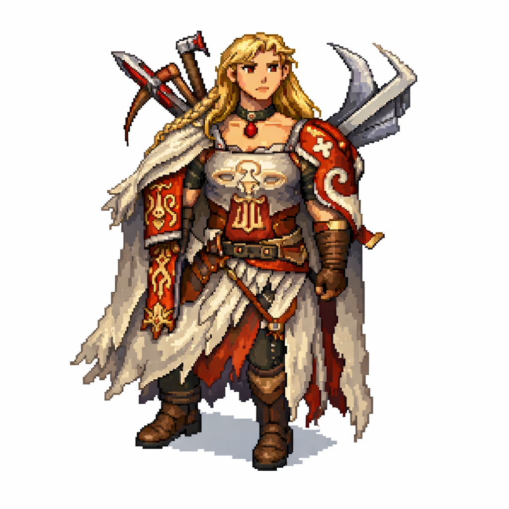

# GabsGame

A Python + Pygame survival prototype with crafting, resource gathering, random quests, and a 2.5D isometric rendering style.



## For Third Parties

GabsGame is an educational, family-friendly game project being developed incrementally with AI-assisted coding.

- Audience: beginner-friendly and suitable for young children.
- Content policy: no nudity, no violence, and no horror.
- Goal: build a clear, maintainable Pygame codebase while teaching programming basics through real project work.
- Current phase: gameplay systems and architecture are in place; visual polish and persistence are next.

If you are reviewing, contributing, or evaluating this project:
- Start with this README and `AI_MEMORY.md` for current engineering context.
- Use small, testable changes and keep commits focused.
- Preserve child-safe design constraints.

## Project Plan

1. Stabilize core gameplay loop
- Keep movement, gathering, crafting, building, and quest completion reliable.
- Preserve responsive controls and clear player feedback.

2. Expand progression systems
- Grow random quest variety and balancing.
- Add better rewards and pacing between early/mid/late quests.

3. Improve world and presentation
- Continue improving 2.5D visuals, readability, and world feel.
- Add optional polish: effects, sounds, animations, UI improvements.

4. Add persistence and content scaling
- Save/load player progress.
- Add more resources, buildables, and map/event variety.

## How To Run

## Requirements
- Python 3.9+
- `pygame`

## Setup
```bash
python3 -m venv venv
source venv/bin/activate
pip install pygame
```

## Start Game
```bash
python main.py
```

## Controls
- Move: Arrow keys
- Cut tree: `L`
- Mine stone: `X` (requires pickaxe)
- Make fire: `F` (cost: 1 wood + 2 stone)
- Build house: `B` (at home area)
- Craft menu: `C` (at home area)
- Home teleport / quest turn-in: click `🏠`
- Close panels/menu: `ESC`

## Gameplay Notes
- Trees and stones respawn over time.
- Inventory panel is clickable for resource details.
- Quests are randomized and tracked as a chain (default: 5 quests).

## Status So Far

Completed:
- Refactored from one large file into modular architecture:
  - `main.py` (entrypoint)
  - `game.py` (main game orchestration)
  - `world.py` (spawn + spatial helpers)
  - `ui.py` (UI drawing helpers)
  - `config.py` (constants/config)
- Added crafting economy updates:
  - Axe cost: 1 wood
  - Pickaxe cost: 2 wood
  - Fire cost: 1 wood + 2 stone
- Implemented random multi-quest system with turn-in via home button.
- Switched rendering style to 2.5D isometric projection.

Current constraints:
- No true 3D engine (rendering is 2.5D/isometric in Pygame).
- No save/load persistence yet.
- No enemy/health/combat system yet.

## TODO List

High priority:
- [ ] Save/load system (inventory, tools, quest chain, world state)
- [ ] Quest balancing (difficulty ramp, anti-repetition rules, reward structure)
- [ ] Improve isometric depth/collision readability near overlapping objects

Medium priority:
- [ ] Add audio (gather, craft, quest complete, UI clicks)
- [ ] Add simple day/night lighting pass
- [ ] Add minimap or directional compass for objectives
- [ ] Add additional resource and crafting tiers

Nice-to-have:
- [ ] Basic NPC or event system
- [ ] Main menu + pause/settings screen
- [ ] Optional controller support

## Repo Workflow

Default branch: `main`

Typical update flow:
```bash
git add .
git commit -m "<message>"
git push
```
